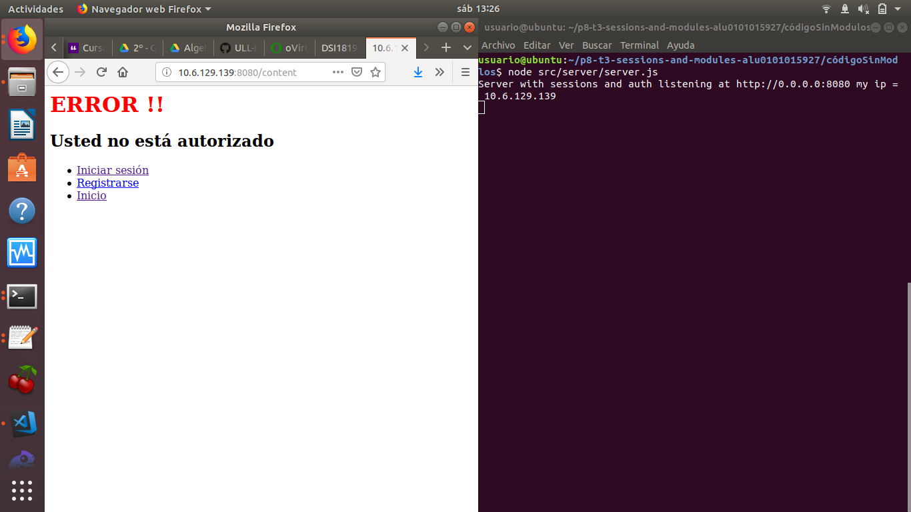
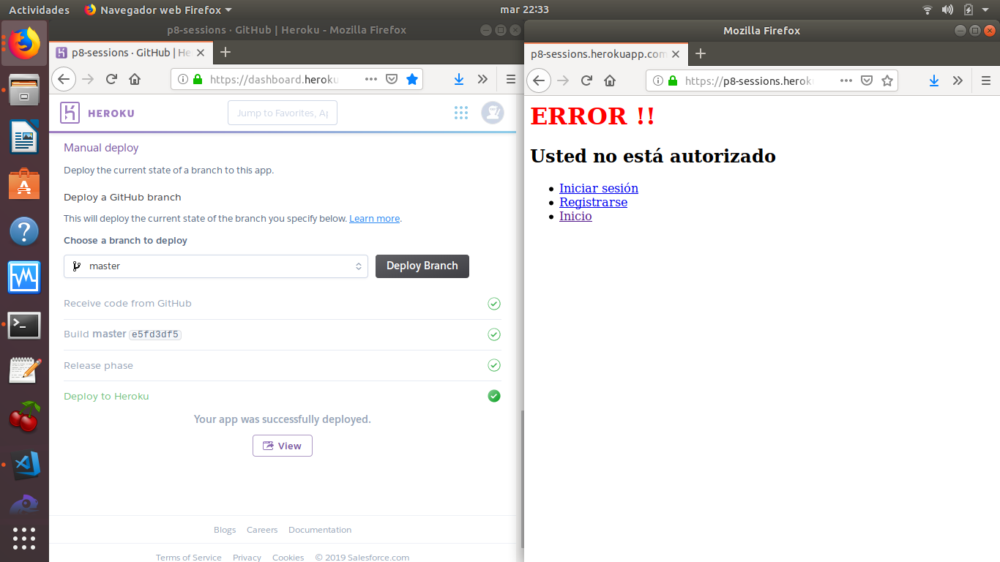

# p8-t3-sessions-and-modules-alu0101015927
p8-t3-sessions-and-modules-alu0101015927 created by GitHub Classroom

En esta practica crearemos y publicaremos un módulo npm que provea un middleware express que provee autenticación para acceder a los ficheros en una determinada ruta.

Para ello crearemos el módulo auth-mgl donde se encontrará el código del módulo de autenticación que publicaremo en npm y el repositorio server-auth con el código del servidor que usa el módulo y que contiene el tutorial.

En este repositorio encontraremos el código descrito anteriormente como dos submódulos git.

## Publicar módulos npm

Para poder publicar un módulo npm primero debemos tener un fichero package.json:
``` bash
  npm init
```
Luego crearemos una cuente en npmjs.com para poder publicarlos.
Por último publicaremos el modulo:
``` bash
npm login 
npm publish
```
Para poder publicar una actualización de nuestro módulo debemos cambiar la versiòn, lo podemos realizar a mano cambiandola en el package.json o ejecutando npm version x.y.z, siendo x.y.z la versión.


## Submódulos git

Primero incluiremos los repositorios como submódulos:
``` bash 
git submodule add url-git nombre
```
se nos habrá creado un fichero .gitmodules donde se encuentra la configuración para almacenar las relaciones entre la URL del proyecto y la subcarpeta local donde se ha colocado este.

## Desplegando el código 

### IAAS 



### Heroku 



